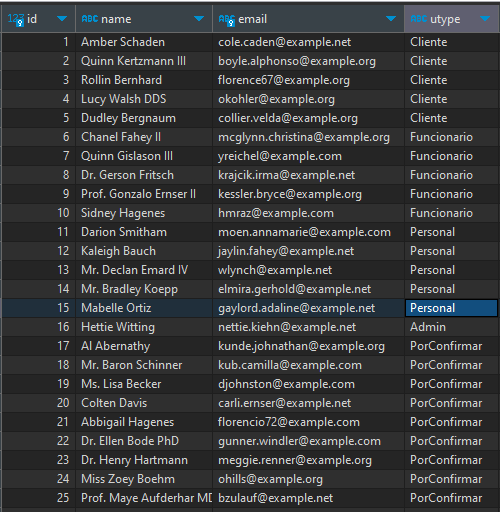

<p align="center"></p>

# PepaGym


- Projeto realizado por Tiago Mateus e Miguel Ribeiro.
- No ambito da realização da Prova de Aptidão Profissional.

# Instruções

1. Execute o seguinte comando, para cria as tabelas da base de dados com dados simulados.

```
sail art migrate:fresh --seed
```

2. Na base de dados, na tabela users, mude o campo utype:
   - Dos 5 primeiros para "Cliente";
   - Do 6º até ao 10º inclusive para "Funcionario";
   - Do 11º até ao 15º inclusive para "Personal";
   - O 16º para "Admin";

## Deverá ficar assim:

<p align="left"></p>

# Licença 

Este projeto é licenciado sob a Licença MIT.